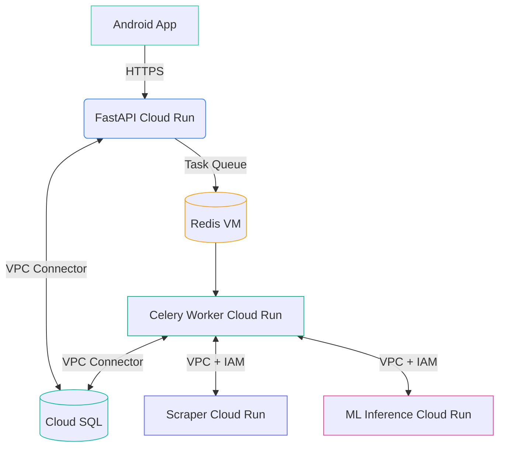

# 👋 Welcome to Project NewsStream

A scalable news app that:
1. **Scrapes** news articles from external sources
2. **Processes** them through ML models
3. **Stores** results in a managed database
4. **Serves** processed data via Android App

## ⛵ Flow-chart


## 🤖 Architecture

Credit: [Eraser – AI co-pilot for technical design](https://app.eraser.io/)


## ⚙️ Core Components

### 1. Services
| Service           | Tech Stack      | Description                          |
|-------------------|-----------------|--------------------------------------|
| Main API          | FastAPI (Python)| REST endpoint for clients             |
| Scraper Service   | FastAPI (Python)| Extracts raw news content             |
| ML Service        | FastAPI (Python)| Analyzes text with NLP models         |
| Celery Worker     | Python          | Background task processor            |
| Android App       | Android (Kotlin) | App for clients                      |

### 2. Infrastructure
- **Message Broker**: Redis VM (Compute Engine)
- **Database**: Cloud SQL (MySQL)
- **Deployment**: Cloud Run (serverless)
- **Scheduling**: Cloud Scheduler

## ⚒️ Task Processing Flow
1. **Scheduling**  
   Cloud Scheduler hits secured `/refresh_news` endpoint hourly
2. **Scraping**  
   Worker fetches new articles via Scraper Service
3. **Processing**  
   Articles are enriched through ML Service
4. **Storage**  
   Results saved to Cloud SQL

## 🔐 Security
- **User Authentication**: JWT based authentication to access REST endpoints for clients
- **Internal Authentication**: IAM-bound OIDC tokens for service-to-service calls
- **Network**: VPC Connector for private communication
- **Secrets**: Google Secret Manager for credentials

## 😍 Contributing
1. Create feature branch  
   `git checkout -b feat/awesome-feature`
2. Commit changes  
   `git commit -m "Add awesome feature"`
3. Push to branch  
   `git push origin feat/awesome-feature`
4. Open PR

## 📄 License
Apache 2.0
```
Copyright 2024 NewsStream

Licensed under the Apache License, Version 2.0 (the "License");
you may not use this file except in compliance with the License.
You may obtain a copy of the License at

   http://www.apache.org/licenses/LICENSE-2.0

Unless required by applicable law or agreed to in writing, software
distributed under the License is distributed on an "AS IS" BASIS,
WITHOUT WARRANTIES OR CONDITIONS OF ANY KIND, either express or implied.
See the License for the specific language governing permissions and
limitations under the License.
```
